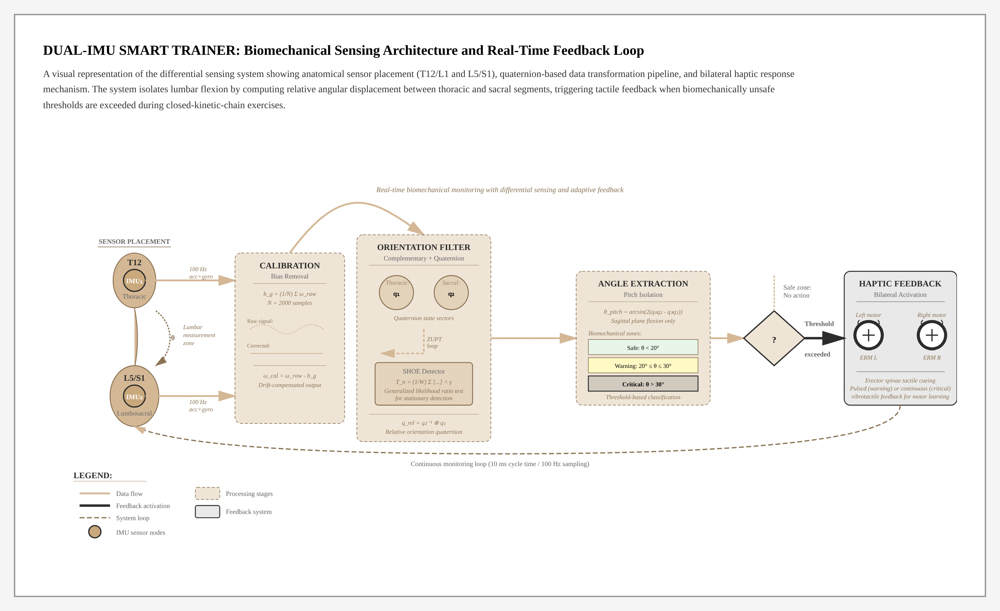
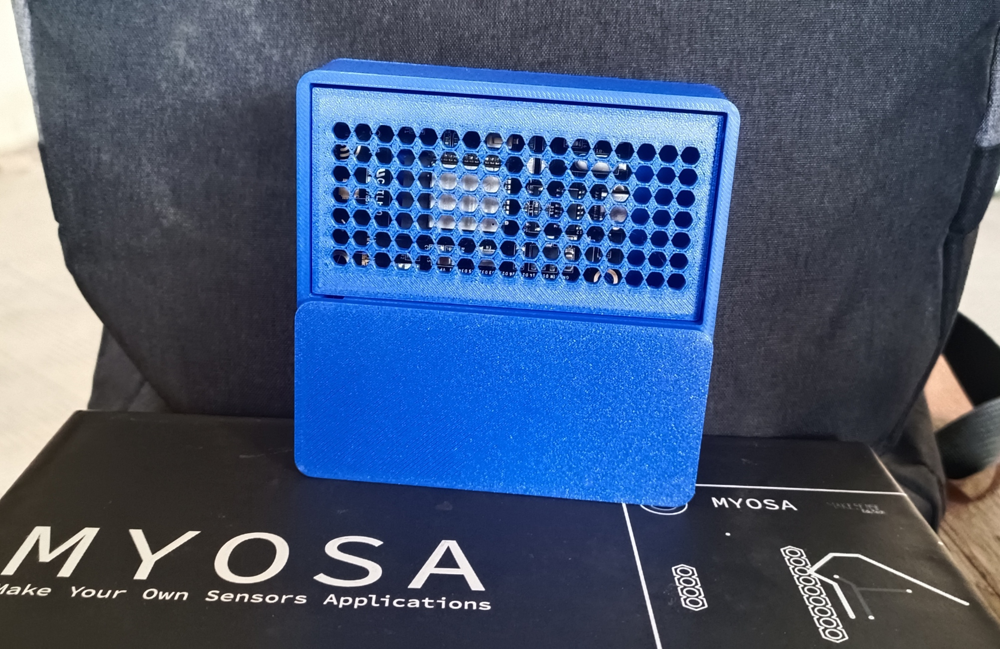
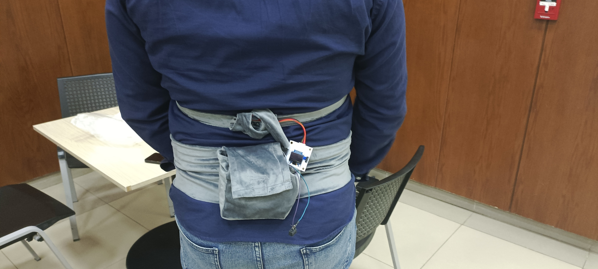
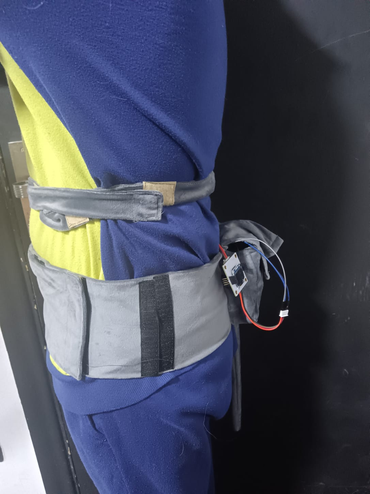

<p align="center">
  <br/>
</p>

# A Dual-IMU Smart Trainer for Real-Time Lumbar Posture Correction in Weightlifting

**A wearable biomechanical system using dual-IMU differential sensing to provide real-time haptic feedback for lumbar injury prevention during resistance training.**

**Tags:** `Biomechanics` `Dual-IMU` `Wearable-Tech` `MYOSA` `Injury-Prevention`

**Date:** December 27, 2025

---

> Mastering the hip hinge: Real-time haptic cueing for a safer, stronger lumbar spine.

---

## Acknowledgements
We would like to express our gratitude to our Faculty Advisor, **Prof. Aliaa Rehan Youssef**, and the Systems and Biomedical Engineering Department at Cairo University for their guidance. This project was developed by Zeyad Ashraf, Andrawos Baheeg, Fady Osama, Amro Fekry.

---

## Overview
Low back pain (LBP) is a common musculoskeletal disorder, with high-load resistance training being a significant risk factor when performed with improper kinematics. This project addresses the inability of novice weightlifters to dissociate hip flexion from lumbar flexion during exercises such as the deadlift and squat.

The **Dual-IMU Smart Trainer** uses a differential sensing architecture to isolate relative lumbar flexion through mathematical subtraction of pelvic motion from thoracic motion. Unlike single-sensor devices that only measure global trunk inclination, this system ensures feedback is only triggered by actual form breakdowns, not healthy hip hinge movements.

**Key features:**
* **Differential Sensing**: Employs two MPU6050 sensors strategically placed at the thoracolumbar (T12/L1) and lumbosacral (L5/S1) junctions.
* **Bilateral Haptic Feedback**: Immediate tactile cueing via vibration motors positioned over the erector spinae muscles.
* **Robust Orientation Filter**: Combines complementary filtering and Zero-Velocity Update (ZUPT) algorithms to mitigate sensor drift.
* **Secure Mobile Integration**: Real-time data visualization via Flutter app, with data secured using AES-CTR encryption over Bluetooth Low Energy.
* **Three-Zone Safety System**: Green, Yellow, and Red zones based on biomechanical safe thresholds.

---

## Demo

### Images
<p align="center">
  <br/>
  <i>The core electronic components: MYOSA ESP32 mainboard and MPU6050 Inertial Measurement Units.</i>
</p>

<p align="center">
  <br/>
  <i>The complete wearable system deployed on a test subject (back view).</i>
</p>

<p align="center">
  <br/>
  <i>Side view showing the system monitoring lumbar posture.</i>
</p>

### Videos
<video controls width="100%">
  <source src="demo-video.mp4" type="video/mp4">
</video>

> **Technical Note on Visualization:** In the demonstration video, a slight forward inclination may be observed even when the user is stationary. This is due to the tracking mechanics used to draw the natural spine. Specifically, the lumbar sensor is positioned on a slightly more forward plane relative to the pelvic sensor due to clothing and textile belt limitations. While this affects the visual representation of the spine *leaning,* it does not impact the accuracy of the relative lumbar flexion angle calculations.

---

## Features (Detailed)

### 1. Differential Sensing & Relative Angle Calculation
The system derives the relative lumbar angle through quaternion-based kinematics using the formula:
```q_rel = q_sac^(-1) ⊗ q_thor```
By isolating the rotation around the pitch axis (sagittal plane), the system specifically detects flexion/extension while ignoring lateral rotation and benign movements. 
The pitch angle is extracted using:
``` θ_pitch = arcsin(2(q₀q₂ - q₃q₁)).```

### 2. Calibration and ZUPT
To eliminate zero-rate error, a blocking calibration routine averages 2000 samples at startup while the user remains stationary in an upright position. During operation, the Stance Hypothesis Optimal Detection (SHOE) algorithm identifies stationary periods by computing a Generalized Likelihood Ratio Test statistic that combines accelerometer variance and gyroscope energy. When stationary periods are detected, Zero-Velocity Updates (ZUPT) are applied to maintain accuracy despite sensor drift.

### 3. Posture Classification
The system employs movement detection that classifies posture into three distinct cases:
* **Flexion**: Detected when angle decreases rapidly (>2° per update, >60°/s)
* **Extension**: Detected when angle increases rapidly
* **Upright**: Detected when near zero angle (<4°) with minimal movement for 250ms

This classification enables the system to distinguish between dynamic movement and stable postures, reducing false positives.

### 4. Threshold-Based Haptic Feedback
The system classifies posture into three zones based on biomechanically safe thresholds derived from powerlifting research:
* **Green (<20°)**: Safe Neutral Zone. No feedback.
* **Yellow (20°–30°)**: Warning Zone. Pulsed haptic feedback (200ms intervals).
* **Red (>30°)**: Critical Zone. Continuous haptic feedback.

The bilateral haptic motors are positioned laterally over the erector spinae muscles, providing intuitive tactile cueing that mimics coach feedback.

### 5. Secure Wireless Communication
All sensor data transmitted via Bluetooth Low Energy is encrypted using AES-CTR (128-bit) with the mbedTLS library. The system requires authentication using a predefined activation key before streaming data, ensuring secure communication between the wearable device and mobile application.

---

## Usage Instructions

### Hardware Setup
1. **Initial Calibration**: Power on the device and remain perfectly still in an upright standing position for approximately 20 seconds. The LED will blink during warmup and stay solid during the 2000-sample bias calibration.
2. **System Placement**: Secure the belt so the Main Control Unit (containing the Pelvis IMU) is positioned at the S1/L5 level (lower back/sacral region). The smaller Thoracic Capsule (Lumbar IMU) should be positioned at the T12/L1 level (mid-back).
3. **Verify Calibration**: After calibration completes, the system will set the upright reference automatically. The LED will turn off when ready.

### Mobile App Connection
1. **Setup**: Access the companion Flutter application:
    #
    A. Install the ```app-release.apk``` into your mobile phone, then add the auth_key (current system key is ```LBPP-DEMO-KEY-2024```) 
    
    B. Clone the project repo
   ```bash
   git clone https://github.com/ziad-ashraf-abdu/lbpp.git
   cd lbpp
   flutter pub get
   flutter run
   ```
2. **View Real-Time Data**: The app displays real-time spine orientation, relative lumbar angle, and safety zone indicators.

### During Exercise
1. Execute your lift (deadlift, squat, etc.).
2. The bilateral motors will provide pulsed feedback if your relative lumbar angle exceeds 20° (warning).
3. Continuous vibration indicates critical flexion - immediately correct your form.
4. Monitor the app for detailed angle measurements and movement classification (Flexion/Extension/Upright).

---

## Tech Stack
* **Microcontroller**: ESP32-WROOM-32E (MYOSA Platform)
* **Sensors**: 2× MPU6050 (6-DoF Accelerometer/Gyroscope)
* **Communication**: Bluetooth Low Energy (BLE)
* **Security**: AES-CTR 128-bit encryption (mbedTLS)
* **Algorithms**: 
  * Complementary Filter for orientation estimation
  * SHOE-based Zero-Velocity Update (ZUPT)
  * Quaternion kinematics for relative angle calculation
  * Advanced posture classification (Flexion/Extension/Upright detection)
* **Hardware Pins**: 
  * LED Indicator: GPIO 2
  * Haptic Motor: GPIO 4
  * Pelvis I²C: SDA 21, SCL 22
  * Lumbar I²C: SDA 32, SCL 33
* **Mobile App**: Flutter (cross-platform)

---

## Requirements / Installation

### Firmware Dependencies
Ensure the following libraries are available in your Arduino IDE environment:
```cpp
Wire.h          // I²C communication
BLEDevice.h     // ESP32 Bluetooth Low Energy
BLEServer.h     // BLE server functionality
BLEUtils.h      // BLE utilities
BLE2902.h       // BLE descriptor
mbedtls/aes.h   // AES encryption
```

### Arduino IDE Setup
1. Install ESP32 board support in Arduino IDE
2. Select "ESP32 Dev Module" as the board
3. Set upload speed to 115200
4. Upload `sketch_sep29a.ino` to your ESP32

### Hardware Connections
**Pelvis IMU (MPU6050 - Address 0x68):**
* SDA → GPIO 21
* SCL → GPIO 22
* VCC → 3.3V
* GND → GND

**Lumbar IMU (MPU6050 - Address 0x69):**
* SDA → GPIO 32
* SCL → GPIO 33
* VCC → 3.3V
* GND → GND

**Haptic Motor:**
* Control Pin → GPIO 4
* Power → Appropriate voltage (typically 3.3V via transistor)


---

## File Structure
```
/smart-lumbar-trainer
  ├─ smart-lumbar-trainer.md
  ├─ cover-image.png
  ├─ demo-video.mp4
  ├─ hardware-components.jpg
  ├─ deployment-back.jpg
  ├─ app-release.apk
  └─ sketch_sep29a/
      ├─ sketch_sep29a.ino              
      ├─ PostureEstimator.h             
      └─ RobustOrientationFilter.h      
```

## Technical Implementation Details

### Sensor Configuration
Both MPU6050 sensors are configured with:
* Gyroscope range: ±500°/s (0x08)
* Accelerometer range: ±8g (0x10)
* Digital Low Pass Filter: 20Hz bandwidth (0x04)
* I²C clock frequency: 400kHz

### Calibration Process
The system performs a 2000-sample gyroscope bias calibration at startup to eliminate zero-rate drift. The bias is computed as:
```
b_g = (1/N) × Σ(ω_raw,i)
```

where N=2000 samples taken while stationary. During operation, corrected angular velocity is:
```
 ω_cal = ω_raw - b_g
 ```

### Orientation Estimation
A complementary filter fuses gyroscope and accelerometer data. The error term is computed as the cross product between normalized acceleration and estimated gravity direction, then fed back with gain β=0.03:
```
e = â × g_est
ω_final = ω_cal - βe
```
### SHOE Detection Algorithm
The Zero-Velocity detector computes a test statistic over a 5-sample sliding window:
```
T_n = (1/W) × Σ[(1/σ_a²)||a_k - g·u_n||² + (1/σ_w²)||ω_k||²]

When T_n < threshold (50.0), the system is deemed stationary and ZUPT is applied.
```

### Data Transmission Format
Encrypted BLE packets contain comma-separated values:
```
pitchP,rollP,yawP,pitchL,rollL,yawL,relativeAngle,Zone|Case
```
Example: `15.2,-2.3,0.1,28.4,-2.1,0.2,13.2,YELLOW|FLEXION`

---

## License
This project is developed as part of academic research at Cairo University. For licensing inquiries, please contact the development team.

---

## Contribution Notes
This project is open for collaborative research and development. To contribute:
1. Fork the repository
2. Create a feature branch
3. Submit pull requests with detailed descriptions
4. Ensure all code follows the established architecture

For questions or collaboration opportunities, contact: ziad.mohamed04@eng-st.cu.edu.eg
