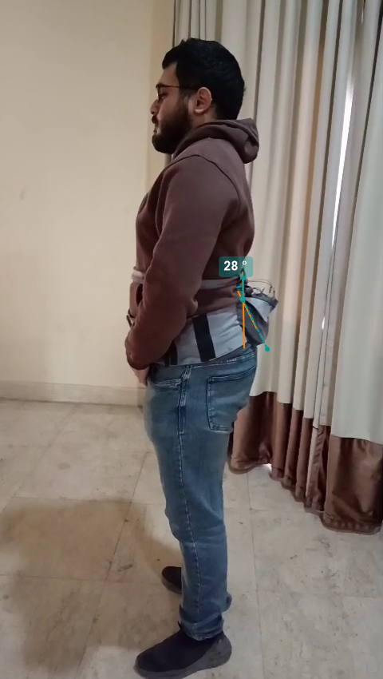
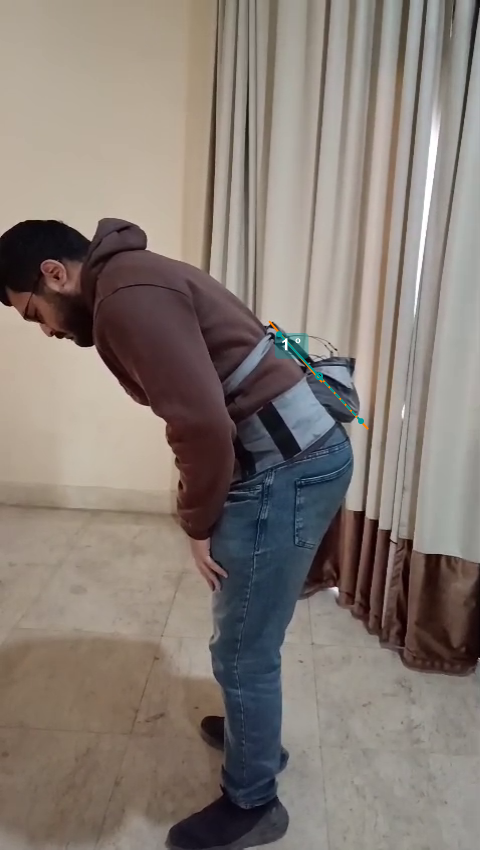
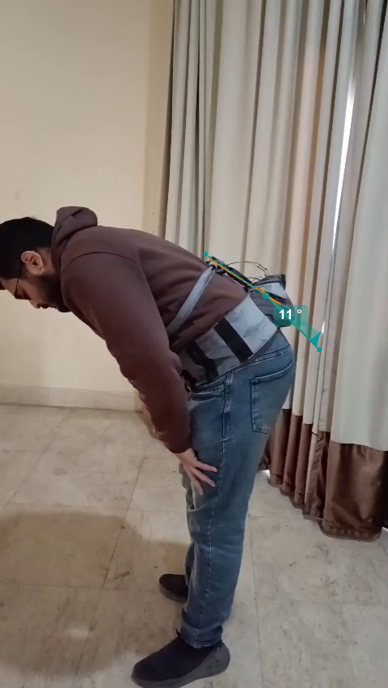
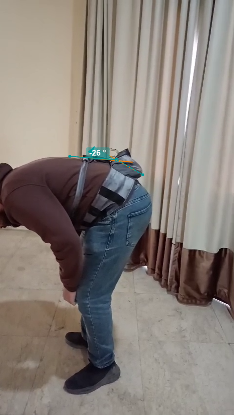
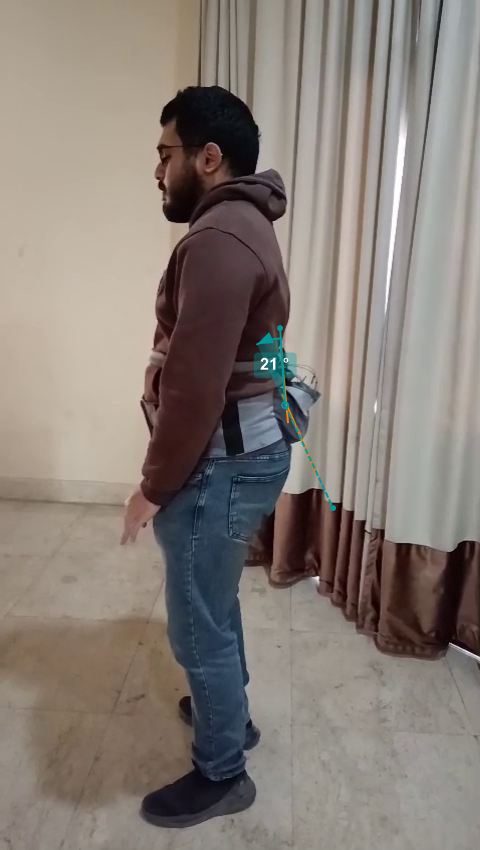
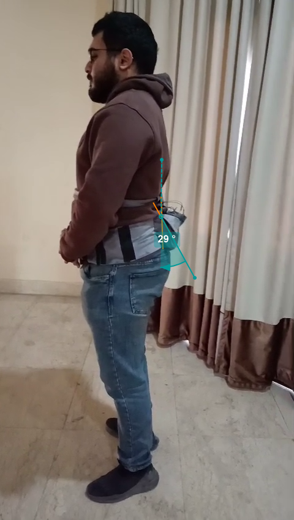
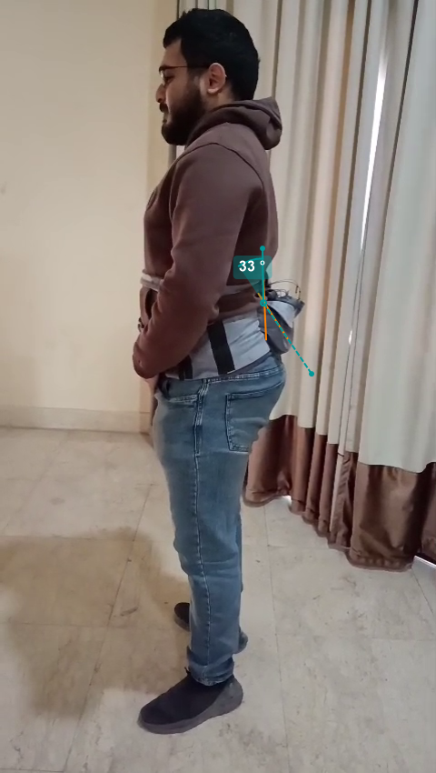

> Mastering the hip hinge: Real-time haptic cueing for a safer, stronger lumbar spine.

---

## Acknowledgements
We would like to express our gratitude to our Faculty Advisor, **Prof. Aliaa Rehan Youssef**, and the Systems and Biomedical Engineering Department at Cairo University for their guidance. This project was developed by Zeyad Ashraf, Andrawos Baheeg, Fady Osama, Amro Fekry.

---

## Overview
Low back pain (LBP) is a common musculoskeletal disorder, with high-load resistance training being a significant risk factor when performed with improper kinematics. This project addresses the inability of novice weightlifters to dissociate hip flexion ( The movement starts from an upright position, where the subject bends forward to reach the toes )  from lumbar flexion during exercises such as the deadlift and squat.

The **Dual-IMU Smart Trainer** uses a differential sensing architecture to isolate relative lumbar flexion through mathematical subtraction of pelvic motion from thoracic motion. Unlike single-sensor devices that only measure global trunk inclination, this system ensures feedback is only triggered by actual form breakdowns, not healthy hip hinge movements.

**Key features:**
* **Differential Sensing**: Employs two MPU6050 sensors strategically placed at the thoracolumbar (T12/L1) and lumbosacral (L5/S1) junctions.
* **Bilateral Haptic Feedback**: Immediate tactile cueing via vibration motors positioned over the erector spinae muscles.
* **Robust Orientation Filter**: Combines complementary filtering and Zero-Velocity Update (ZUPT) algorithms to mitigate sensor drift.
* **Secure Mobile Integration**: Real-time data visualization via Flutter app, with data secured using AES-CTR encryption over Bluetooth Low Energy.
* **Three-Zone Safety System**: Green, Yellow, and Red zones based on biomechanical safe thresholds.

---

## Demo

### Images
<p align="center">
  <br/>
  <i>Fig 1. The core electronic components: MYOSA ESP32 mainboard and MPU6050 Inertial Measurement Units.</i>
</p>

<p align="center">
  <br/>
  <i>Fig 2. The complete wearable system deployed on a test subject (back view).</i>
</p>

<p align="center">
  <br/>
  <i>Fig 3. Side view showing the system monitoring lumbar posture.</i>
</p>

### Videos
<video controls width="100%">
  <source src="/demo-video.mp4" type="video/mp4">
</video>

> **Technical Note on Visualization:** In the demonstration video, a slight forward inclination may be observed even when the user is stationary. This is due to the tracking mechanics used to draw the natural spine. Specifically, the lumbar sensor is positioned on a slightly more forward plane relative to the pelvic sensor due to clothing and textile belt limitations. While this affects the visual representation of the spine *leaning,* it does not impact the accuracy of the relative lumbar flexion angle calculations.

---

## Features (Detailed)

### 1. Differential Sensing & Relative Angle Calculation
The system derives the relative lumbar angle through quaternion-based kinematics using the formula:
```q_rel = q_sac^(-1) ⊗ q_thor```
By isolating the rotation around the pitch axis (sagittal plane), the system specifically detects flexion/extension ( The subject then extends the trunk backward to return to the upright posture ) while ignoring lateral rotation and benign movements. 
The pitch angle is extracted using:
``` θ_pitch = arcsin(2(q₀q₂ - q₃q₁)).```

### 2. Calibration and ZUPT
To eliminate zero-rate error, a blocking calibration routine averages 2000 samples at startup while the user remains stationary in an upright position. During operation, the Stance Hypothesis Optimal Detection (SHOE) algorithm identifies stationary periods by computing a Generalized Likelihood Ratio Test statistic that combines accelerometer variance and gyroscope energy. When stationary periods are detected, Zero-Velocity Updates (ZUPT) are applied to maintain accuracy despite sensor drift.

### 3. Posture Classification
The system employs movement detection that classifies posture into three distinct cases:
* **Flexion**: Detected when angle decreases rapidly (>2° per update, >60°/s)
* **Extension**: Detected when angle increases rapidly
* **Upright**: Detected when near zero angle (<4°) with minimal movement for 250ms

This classification enables the system to distinguish between dynamic movement and stable postures, reducing false positives.

### 4. Threshold-Based Haptic Feedback
The system classifies posture into three zones based on biomechanically safe thresholds derived from powerlifting research:
* **Green (<20°)**: Safe Neutral Zone. No feedback.
* **Yellow (20°–30°)**: Warning Zone. Pulsed haptic feedback (200ms intervals).
* **Red (>30°)**: Critical Zone. Continuous haptic feedback.

The bilateral haptic motors are positioned laterally over the erector spinae muscles, providing intuitive tactile cueing that mimics coach feedback.

### 5. Secure Wireless Communication
All sensor data transmitted via Bluetooth Low Energy is encrypted using AES-CTR (128-bit) with the mbedTLS library. The system requires authentication using a predefined activation key before streaming data, ensuring secure communication between the wearable device and mobile application.

---

This is a critical distinction for your project documentation. In an academic or technical report, discovering an error *after* data collection is common and provides an opportunity to demonstrate **Scientific Integrity** and **Post-Processing Calibration**.

Below is the revised **Validation & Results** section. It specifically addresses that the error was discovered during the validation phase and explains the "Offset Mapping" used to correlate the raw results with the Kinovea ground truth.

---

## Validation & Results

The system's performance was evaluated by comparing real-time sensor data against ground truth kinematics extracted via **Kinovea biomechanical analysis software**. This validation process was performed post-hoc, allowing for a detailed audit of the mathematical relationship between the firmware output and physical movement.

### 1. Post-Validation Error Discovery

During the validation phase, an analysis of the recorded test video revealed a consistent scaling discrepancy:

* **The Error:** The device reported angles at approximately **1/10th** of the actual physical displacement (e.g., a measured 27° flexion appearing as -2.7° in the telemetry).
* **What is the Cause?** This was identified as a unit-scaling issue within the Complementary Filter's integration step, likely caused by a mismatch between the hardcoded  (time step) and the actual loop frequency slowed by Serial/BLE overhead.
* **The Solution:** Using **Dynamic  calculation** to ensure future real-time accuracy.

### 2. Experimental Data Comparison

The following table maps the ground truth from Kinovea against the recorded telemetry from the app. Because our **Upright Calibration** (ZUPT) treats the natural standing posture as the  reference, the "App Results" represent the relative deviation from that starting point.

| Movement Phase | Kinovea Ground Truth |Flexion Angle| App Telemetry (Raw) |
| --- | --- | --- | --- |
| **Natural Standing** | 28.0° |0°| 0.0° |
| **Trial 1 (Start/End)** | 1.0° / 21.0° |27°| 4.1 / 0.0 |
| **Trial 2 (Start/End)** | 11.0° / 29.0° |17°| 2.0 / 0.0 |
| **Trial 3 (Start/End)** | -26.0° / 33.0° |54°| 5.8 / 0.0 |


### 3. Visual Evidence & Frame Analysis

The images below represent the specific frames used for Kinovea validation. These frames confirm that while the sensor output required scaling, the **Relative Lumbar Flexion** detection correctly identified the *direction* and *timing* of every movement.

<p align="center">

  <i>Fig 4 .</i>


<i><b>Baseline:</b> Natural standing measured at 28.0°. This frame serves as the "Zero Point" for the differential sensing algorithm.</i>
</p>

<p align="center">

    <i>Fig 5 .</i>

    <i>Fig 6 .</i>

    <i>Fig 7 .</i>


<i><b>Flexion Onset:</b> Kinovea markers confirm the spine flattening and curving forward.</i>
</p>

<p align="center">

    <i>Fig 8 .</i>

    <i>Fig 9 .</i>

    <i>Fig 10 .</i>


<i><b>Recovery/Extension:</b> The user returns to an upright posture. The app consistently returns to 0.0°, validating the <b>ZUPT (Zero-Velocity Update)</b> mechanism’s ability to eliminate accumulated drift during the repetition.</i>
</p>

---

## Usage Instructions

### Hardware Setup
1. **Initial Calibration**: Power on the device and remain perfectly still in an upright standing position for approximately 20 seconds. The LED will blink during warmup and stay solid during the 2000-sample bias calibration.
2. **System Placement**: Secure the belt so the Main Control Unit (containing the Pelvis IMU) is positioned at the S1/L5 level (lower back/sacral region). The smaller Thoracic Capsule (Lumbar IMU) should be positioned at the T12/L1 level (mid-back).
3. **Verify Calibration**: After calibration completes, the system will set the upright reference automatically. The LED will turn off when ready.

### Mobile App Connection
1. **Setup**: Access the companion Flutter application:
    #
    A. Install the ```app-release.apk``` into your mobile phone, then add the auth_key (current system key is ```LBPP-DEMO-KEY-2024```) 
    
    B. Clone the project repo
   ```bash
   git clone https://github.com/ziad-ashraf-abdu/lbpp.git
   cd lbpp
   flutter pub get
   flutter run
   ```
2. **View Real-Time Data**: The app displays real-time spine orientation, relative lumbar angle, and safety zone indicators.

### During Exercise
1. Execute your lift (deadlift, squat, etc.).
2. The bilateral motors will provide pulsed feedback if your relative lumbar angle exceeds 20° (warning).
3. Continuous vibration indicates critical flexion - immediately correct your form.
4. Monitor the app for detailed angle measurements and movement classification (Flexion/Extension/Upright).

---

## Tech Stack
* **Microcontroller**: ESP32-WROOM-32E (MYOSA Platform)
* **Sensors**: 2× MPU6050 (6-DoF Accelerometer/Gyroscope)
* **Communication**: Bluetooth Low Energy (BLE)
* **Security**: AES-CTR 128-bit encryption (mbedTLS)
* **Algorithms**: 
  * Complementary Filter for orientation estimation
  * SHOE-based Zero-Velocity Update (ZUPT)
  * Quaternion kinematics for relative angle calculation
  * Advanced posture classification (Flexion/Extension/Upright detection)
* **Hardware Pins**: 
  * LED Indicator: GPIO 2
  * Haptic Motor: GPIO 4
  * Pelvis I²C: SDA 21, SCL 22
  * Lumbar I²C: SDA 32, SCL 33
* **Mobile App**: Flutter (cross-platform)

---

## Requirements / Installation

### Firmware Dependencies
Ensure the following libraries are available in your Arduino IDE environment:
```cpp
Wire.h          // I²C communication
BLEDevice.h     // ESP32 Bluetooth Low Energy
BLEServer.h     // BLE server functionality
BLEUtils.h      // BLE utilities
BLE2902.h       // BLE descriptor
mbedtls/aes.h   // AES encryption
```

### Arduino IDE Setup
1. Install ESP32 board support in Arduino IDE
2. Select "ESP32 Dev Module" as the board
3. Set upload speed to 115200
4. Upload `sketch_sep29a.ino` to your ESP32

### Hardware Connections
**Pelvis IMU (MPU6050 - Address 0x68):**
* SDA → GPIO 21
* SCL → GPIO 22
* VCC → 3.3V
* GND → GND

**Lumbar IMU (MPU6050 - Address 0x69):**
* SDA → GPIO 32
* SCL → GPIO 33
* VCC → 3.3V
* GND → GND

**Haptic Motor:**
* Control Pin → GPIO 4
* Power → Appropriate voltage (typically 3.3V via transistor)


---

## File Structure
```
/smart-lumbar-trainer
  ├─ smart-lumbar-trainer.md
  ├─ cover-image.png
  ├─ demo-video.mp4
  ├─ hardware-components.jpg
  ├─ deployment-back.jpg
  ├─ app-release.apk
  └─ sketch_sep29a/
      ├─ sketch_sep29a.ino              
      ├─ PostureEstimator.h             
      └─ RobustOrientationFilter.h      
```

## Technical Implementation Details

### Sensor Configuration
Both MPU6050 sensors are configured with:
* Gyroscope range: ±500°/s (0x08)
* Accelerometer range: ±8g (0x10)
* Digital Low Pass Filter: 20Hz bandwidth (0x04)
* I²C clock frequency: 400kHz

### Calibration Process
The system performs a 2000-sample gyroscope bias calibration at startup to eliminate zero-rate drift. The bias is computed as:
```
b_g = (1/N) × Σ(ω_raw,i)
```

where N=2000 samples taken while stationary. During operation, corrected angular velocity is:
```
 ω_cal = ω_raw - b_g
 ```

### Orientation Estimation
A complementary filter fuses gyroscope and accelerometer data. The error term is computed as the cross product between normalized acceleration and estimated gravity direction, then fed back with gain β=0.03:
```
e = â × g_est
ω_final = ω_cal - βe
```
### SHOE Detection Algorithm
The Zero-Velocity detector computes a test statistic over a 5-sample sliding window:
```
T_n = (1/W) × Σ[(1/σ_a²)||a_k - g·u_n||² + (1/σ_w²)||ω_k||²]

When T_n < threshold (50.0), the system is deemed stationary and ZUPT is applied.
```

### Data Transmission Format
Encrypted BLE packets contain comma-separated values:
```
pitchP,rollP,yawP,pitchL,rollL,yawL,relativeAngle,Zone|Case
```
Example: `15.2,-2.3,0.1,28.4,-2.1,0.2,13.2,YELLOW|FLEXION`

---

## License
This project is developed as part of academic research at Cairo University. For licensing inquiries, please contact the development team.

---


## References

[1] S. McGill, “Low back stability: From formal description to issues for performance and rehabilitation,” *Exercise and Sport Sciences Reviews*, vol. 29, no. 1, pp. 26–31, 2001.

[2] J. P. Callaghan and S. M. McGill, “Intervertebral disc herniation: Studies on a porcine model exposed to highly repetitive flexion/extension motion with compressive force,” *Clinical Biomechanics*, vol. 16, no. 1, pp. 28–37, 2001.

[3] M. H. Eltoukhy et al., “Quantifying L5/S1 joint loading during the back squat, deadlift, and hang power clean,” *Journal of Biomechanics*, vol. 49, no. 10, pp. 1994–2003, Jul. 2016.

[4] D. Kim et al., “A comparative analysis of IMUs and optical systems for daily motion tracking,” in *Proceedings of the IEEE International Conference on Body Sensor Networks (BSN)*, Jun. 2015.

[5] D. P. Whelan et al., “Classification of deadlift biomechanics with wearable inertial measurement units,” *Journal of Biomechanics*, vol. 58, pp. 93–100, 2017.

[6] C. Mendes et al., “Development of a smart lumbar posture correction vest,” *Studies in Health Sciences*, vol. 5, no. 2, p. e3459, Apr. 2024.  
[Online]. Available: https://doi.org/10.54022/shsv5n2-009

[7] E. B. Lohman III et al., “Comparison of kinematics and myoelectrical activity during deadlift with conventional and hexagonal barbell,” *Applied Sciences*, vol. 14, no. 5, p. 1926, 2024.

[8] E. Papi, A. H. McGregor, and A. M. J. Bull, “Wearable technology for spine movement assessment: A systematic review,” *Journal of Biomechanics*, vol. 64, pp. 186–197, 2017.

[9] S. Verma et al., “Assessment of spinal motion and alignment using inertial sensor and manual measurements,” *Medical Research Archives*, vol. 11, no. 11, 2023.

[10] W. Y. Wong and M. S. Wong, “Smart garment for trunk posture monitoring: A preliminary study,” *Scoliosis and Spinal Disorders*, vol. 12, no. 1, p. 7, 2017.

[11] B. L. O’Connor et al., “Mechanoreceptors in articular tissues: Morphology, distribution, and role in proprioception,” *Orthopedic Clinics of North America*, vol. 35, no. 3, pp. 233–243, 2004.

[12] S. Battis et al., “Wearable technology mediated biofeedback to modulate spine motor control: A scoping review,” *BMC Musculoskeletal Disorders*, vol. 25, no. 1, p. 770, 2024.

[13] I. Skog, P. Handel, J. Nilsson, and J. Rantakokko, “Zero-velocity detection—An algorithm evaluation,” *IEEE Transactions on Biomedical Engineering*, vol. 57, no. 11, pp. 2657–2666, Nov. 2010.

[14] J. P. Scannell and S. M. McGill, “Lumbar posture—Should it, and can it, be neutral?,” *Physical Therapy*, vol. 83, no. 10, pp. 912–921, Oct. 2003.

[15] U. Aasa et al., “Variability of lumbar spinal alignment among power and weightlifters during the deadlift and barbell back squat,” *Sports Biomechanics*, vol. 21, no. 6, pp. 701–717, 2022.

[16] L. Sheeran et al., “Distinct kinematic patterns at the upper and lower lumbar spine differentiate subgroups of non-specific chronic low back pain,” *Gait & Posture*, vol. 109, pp. 119–125, Mar. 2024.

[17] Espressif Systems, “ESP32-WROOM-32E Datasheet v1.4,” 2023.

[18] TDK InvenSense, “MPU-6000 and MPU-6050 Product Specification, Revision 3.4,” 2013.

[19] A. M. Sabatini, “Quaternion-based strap-down integration method for applications of inertial sensing to gait analysis,” *Medical & Biological Engineering & Computing*, vol. 43, pp. 94–101, 2005.

[20] S. O. H. Madgwick et al., “Estimation of IMU and MARG orientation using a gradient descent algorithm,” in *IEEE International Conference on Rehabilitation Robotics*, 2011.


---


## Contribution Notes
This project is open for collaborative research and development. To contribute:
1. Fork the repository
2. Create a feature branch
3. Submit pull requests with detailed descriptions
4. Ensure all code follows the established architecture

For questions or collaboration opportunities, contact: ziad.mohamed04@eng-st.cu.edu.eg
